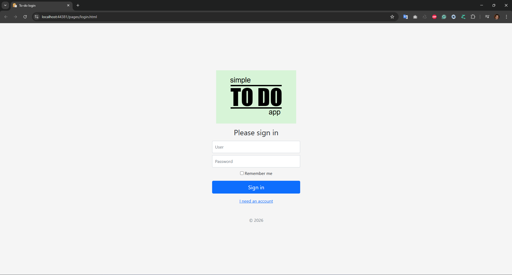
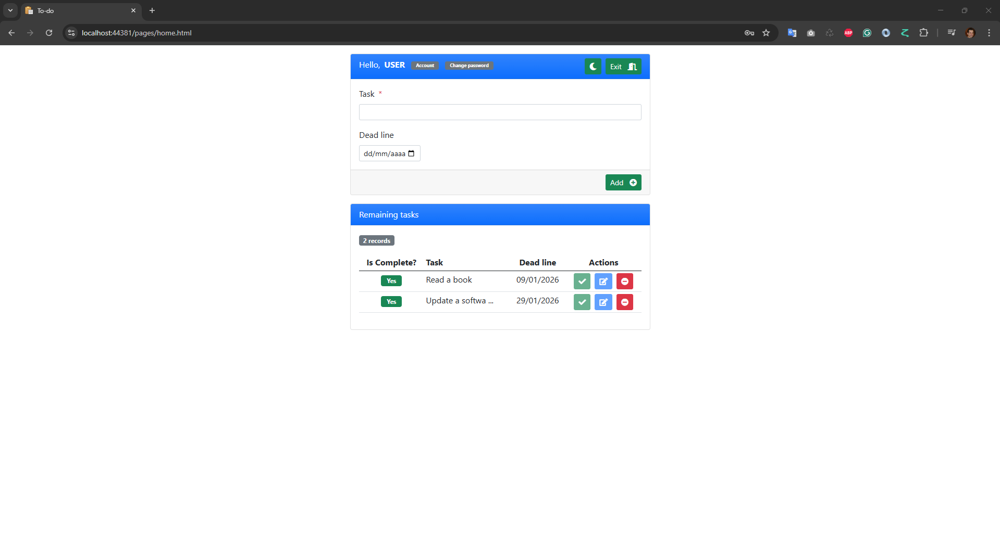
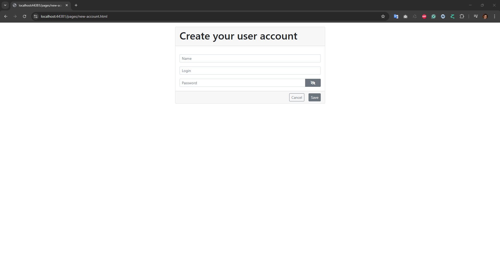

# Todo App

A simple and educational task management application built with Clean Architecture principles.

## ?? About

This project is a simplified task registration system designed as a learning platform for web development best practices. It demonstrates a full-stack implementation with a clean separation of concerns and modern development patterns.

## ? Features

- User authentication and registration
- Task creation, editing, and deletion
- User profile management
- Responsive design
- RESTful API architecture

## ??? Screenshots

### Login Screen


### Task Management


### Account Creation


## ??? Architecture

The project follows Clean Architecture principles with a clear separation between layers:

### Backend (.NET)
- **Todo.API**: RESTful API endpoints and controllers
- **Todo.Application**: Application services, DTOs, and business logic orchestration
- **Todo.Domain**: Domain entities, business rules, and interfaces
- **Todo.Infrastructure.Persistence**: Data access layer with Entity Framework Core
- **Todo.Infrastructure.IoC**: Dependency injection configuration

### Frontend
- **Todo.WebClient**: Web interface built with HTML, Bootstrap CSS, and Vanilla JavaScript
  - Minimal use of external libraries
  - Responsive design
  - Client-side validation

### Tests
- **Todo.UnitTests**: Unit tests for business logic
- **Todo.IntegrationTests**: Integration tests
- **Todo.FunctionalTests**: End-to-end functional tests

## ??? Tech Stack

**Backend:**
- C# / .NET
- Entity Framework Core
- SQL Server
- RESTful API

**Frontend:**
- HTML5
- CSS3 / Bootstrap
- Vanilla JavaScript

**Testing:**
- xUnit / NUnit
- Integration and Unit Testing frameworks

## ?? Getting Started

### Prerequisites

- .NET SDK (version compatible with the project)
- SQL Server (LocalDB, Express, or Full Edition)
- Visual Studio 2019+ or Visual Studio Code
- Git

### Installation

1. **Clone the repository**
   ```bash
   git clone https://github.com/mchomem/Todo.git
   cd Todo
   ```

2. **Configure the database connection**
   
   Update the connection string in `Todo.API/appsettings.json`:
   ```json
   "ConnectionStrings": {
     "DefaultConnection": "Server=(localdb)\\mssqllocaldb;Database=TodoDb;Trusted_Connection=True;"
   }
   ```

3. **Create the database**

   Open the Package Manager Console in Visual Studio and run:
   ```powershell
   add-migration DbInit -Context TodoContext -Project Todo.Infrastructure.Persistence -StartupProject Todo.API
   update-database -Context TodoContext -Project Todo.Infrastructure.Persistence -StartupProject Todo.API
   ```

4. **Run the application**
   
   Set `Todo.API` and `Todo.WebClient` as startup projects (for multiple projects) or run them separately:
   - Start the API: Navigate to `Todo.API` and run `dotnet run`
   - Start the Web Client: Navigate to `Todo.WebClient` and run `dotnet run`

## ?? Usage

1. Access the web application at `https://localhost:[port]`
2. Create a new account or login with existing credentials
3. Start managing your tasks!

## ??? Database Migrations

### Creating a new migration

```powershell
add-migration [MigrationName] -Context TodoContext -Project Todo.Infrastructure.Persistence -StartupProject Todo.API
```

### Updating the database

```powershell
update-database -Context TodoContext -Project Todo.Infrastructure.Persistence -StartupProject Todo.API
```

### Removing the last migration

```powershell
remove-migration -Context TodoContext -Project Todo.Infrastructure.Persistence
```

## ?? Running Tests

```bash
dotnet test
```

Or run specific test projects:
```bash
dotnet test Todo.UnitTests
dotnet test Todo.IntegrationTests
dotnet test Todo.FunctionalTests
```

## ?? Contributing

This is an educational project, but contributions are welcome! Feel free to:

1. Fork the project
2. Create a feature branch (`git checkout -b feature/AmazingFeature`)
3. Commit your changes (`git commit -m 'Add some AmazingFeature'`)
4. Push to the branch (`git push origin feature/AmazingFeature`)
5. Open a Pull Request

## ?? License

This project is open source and available for educational purposes.

## ?? Author

**mchomem**
- GitHub: [@mchomem](https://github.com/mchomem)

## ?? Learning Objectives

This project demonstrates:
- Clean Architecture implementation in .NET
- RESTful API design
- Entity Framework Core with Code-First approach
- Repository and Unit of Work patterns
- Dependency Injection
- Frontend-Backend separation
- Authentication and Authorization
- Automated testing (Unit, Integration, and Functional)

## ?? Project Status

This project is actively maintained for educational purposes and continuous learning.

---

? If this project helped you learn something new, consider giving it a star!


